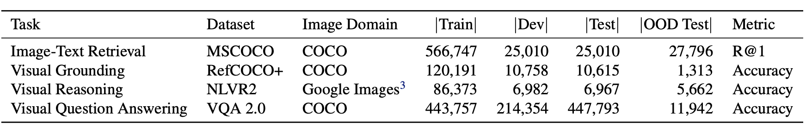
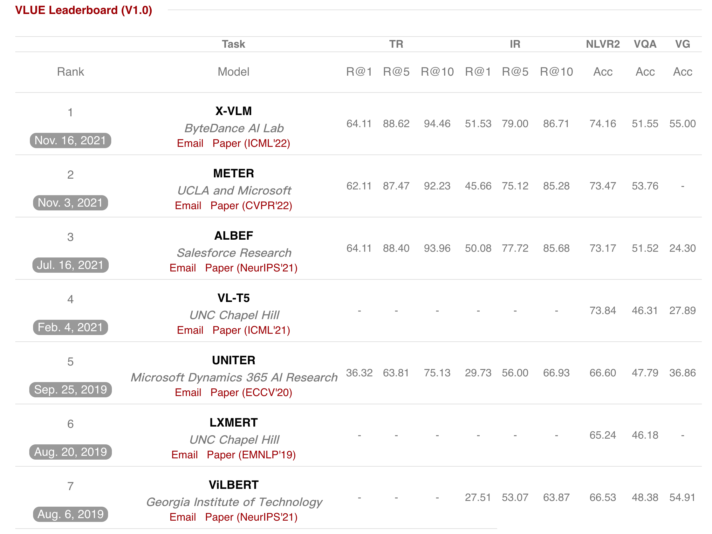

# VLUE: A Multi-task Benchmark for Evaluating Vision-Language Pre-training

[**Tasks**](#tasks-and-OOD-test-sets) | [**Download**](#download-the-data) |
[**Baselines**](#build-a-baseline-system) |
[**Leaderboard**](https://vlue-benchmark.github.io/leaderboard.html) |
[**Website**](https://vlue-benchmark.github.io) |
[**Efficiency**](#efficiency-performance-trade-off)
[**Paper**](https://arxiv.org/pdf/2205.xxxx.pdf) 

This repository contains information about the Vision-Language Understanding Evaluation (VLUE) benchmark, instructions for downloading data, and
implementations of baseline systems for the benchmark.

# Introduction

The Vision-Language Understanding Evaluation (VLUE) benchmark is a benchmark for the evaluation of the generalization ability and efficiency-performance trade-off of pre-trained vision-language models. It benchmarks the performance of popular pre-trained vision-language models on representative Vision-Language tasks and also provides a suite of newly croudsourced out-of-distribution (OOD) test sets for each of the tasks, which are used to benchmark the true generalization/transfer ability of pre-trained vision-language models.

For a full description of the benchmark, see [the paper](https://arxiv.org/abs/2205.xxxx).

# Tasks and OOD Test Sets

VLUE covers 4 representative vision-and-language understanding tasks including Image-Text Retrieval, Visual Grouding, Visual Reasoning, and Visual Question Answering. Statistics of datasets are shown in the image below.



We crowdsource OOD test sets for the 4 tasks in the VLUE benchmark using the raw images from the [MaRVL dataset](https://marvl-challenge.github.io), which contains images from a diverse distribution across countries and cultures. We hire human annotators to contruct test examples for the four tasks using the raw images following the annotation instructions from the original datasets.  

Note that the Image-Text Retrieval OOD test set can also be used to evaluate image captioning models.  

# Download the data

We provide intructions to download the data for both the original in-domain datasets and the private OOD test sets.

The images and annotations for the train, dev, and test set of the in-domain datasets can be downloaded [here](https://drive.google.com/file/d/1XFz1Vtz7MCBLn4_1QEojhFJ5Iw3eH3X4/view?usp=sharing).

The images used in the GLUE dataset can be downloaded in the [MaRVL website](https://marvl-challenge.github.io/download).

The annotations for the OOD test sets are included in the data folder.


# Build a baseline system

We provide the examples to evalute on VLUE OOD test sets with [X-VLM](https://github.com/zengyan-97/X-VLM) as follows: 
```angular2html
cp -r data/ xvlm/data/vlue_released
cd xvlm

python3 run.py --task "eval_vlue_itr" --dist "1" --evaluate  --output_dir "output/" --checkpoint "itr_coco/checkpoint_9.pth"

python3 run.py --task "eval_vlue_vqa" --dist "1" --evaluate  --output_dir "output/" --checkpoint "vqa/model_state_epoch_9.th"

python3 run.py --task "eval_vlue_nlvr" --dist "1" --evaluate  --output_dir "output/" --checkpoint "nlvr/nlvr_ft/checkpoint_best.pth"

python3 run.py --task "eval_vlue_refcoco" --dist "1" --evaluate  --output_dir "output/" --checkpoint "refcoco_bbox/checkpoint_best.pth"

python3 run.py --task "eval_vlue_refcoco_weakly" --dist "1" --evaluate  --output_dir "output/" --checkpoint "refcoco/checkpoint_best.pth"
```


# Leaderboard

## Leaderboard Results




## Submissions

You are welcome to test your vision-language models on the VLUE benchmark! Labeled OOD test sets and evaluation scripts are released in the repo. After obtaining results, you are welcome email [**VLUE team**](wcszhou@outlook.com) to get your model included in the [**VLUE Learderboard**](https://vlue-benchmark.github.io/VLUE-website/leaderboard.html). Your email should contain information displayed in the leaderboard (i.e., paper link/description, results on original test sets and OOD test sets.)  

# Efficiency-Performance Trade-off

We also encourage researchers to report the efficiency-performance trade-off of their models in their paper to measure the "Pareto improvement" on training vision-language models. We consider the actual inference time as the main efficiency metric. However, the actual inference time of different models depends on hardware. Therefore, you are welcome to measure and compare the actual inference time of your models and baselines by yourself.
 We provide the code for measuring actual inference time of in the above example.  
 
We provide the actual inference time of popular vision-language models in our setting (1 Nvidia Tesla V100 GPU and a batch size of 1) in the Appendix of our paper for reference.  

# Other Usage

While the intended use of the collected OOD data is to evalute vision-language models via direct OOD generalization (i.e., fine-tune on original datasets then directly test on OOD test sets), it is also possible to fine-tune, or few-shot fine-tune on a subset of the provided OOD data for other research settings such as transfer learning and domain adaptation.

# Citation

If you use our benchmark or the code in this repo, please consider cite our paper `\cite{zhou2022vlue}`.
```
@article{xx,
      author    = {xx},
      title     = {xx},
      journal   = {CoRR},
      volume    = {abs/2003.11080},
      year      = {2020},
      archivePrefix = {arXiv},
      eprint    = {2003.11080}
}
```
Please consider including a note similar to the one below to make sure to cite all the individual datasets in your paper.

We experiment on the VLUE benchmark `\cite{zhou2022vlue}`, a multi-task multi-dimension benchmark for visual-language understanding evaluation consisting of data from the MSCOCO Caption `\cite{chen2015microsoft}`, RefCOCO `\cite{yu2016modeling}`, NLVR2 `\cite{suhr2018corpus}`, VQA 2.0 `\cite{goyal2017making}` datasets, and raw images from the MaRVL dataset `\cite{goyal2017making}` for the private OOD test set.  We provide their BibTex information as follows.
```
@article{chen2015microsoft,
  title={Microsoft coco captions: Data collection and evaluation server},
  author={Chen, Xinlei and Fang, Hao and Lin, Tsung-Yi and Vedantam, Ramakrishna and Gupta, Saurabh and Doll{\'a}r, Piotr and Zitnick, C Lawrence},
  journal={arXiv preprint arXiv:1504.00325},
  year={2015}
}

@inproceedings{yu2016modeling,
  title={Modeling context in referring expressions},
  author={Yu, Licheng and Poirson, Patrick and Yang, Shan and Berg, Alexander C and Berg, Tamara L},
  booktitle={European Conference on Computer Vision},
  pages={69--85},
  year={2016},
  organization={Springer}
}

@article{suhr2018corpus,
  title={A corpus for reasoning about natural language grounded in photographs},
  author={Suhr, Alane and Zhou, Stephanie and Zhang, Ally and Zhang, Iris and Bai, Huajun and Artzi, Yoav},
  journal={arXiv preprint arXiv:1811.00491},
  year={2018}
}

@inproceedings{goyal2017making,
  title={Making the v in vqa matter: Elevating the role of image understanding in visual question answering},
  author={Goyal, Yash and Khot, Tejas and Summers-Stay, Douglas and Batra, Dhruv and Parikh, Devi},
  booktitle={Proceedings of the IEEE conference on computer vision and pattern recognition},
  pages={6904--6913},
  year={2017}
}

@article{liu2021visually,
  title={Visually Grounded Reasoning across Languages and Cultures},
  author={Liu, Fangyu and Bugliarello, Emanuele and Ponti, Edoardo Maria and Reddy, Siva and Collier, Nigel and Elliott, Desmond},
  journal={arXiv preprint arXiv:2109.13238},
  year={2021}
}
```
